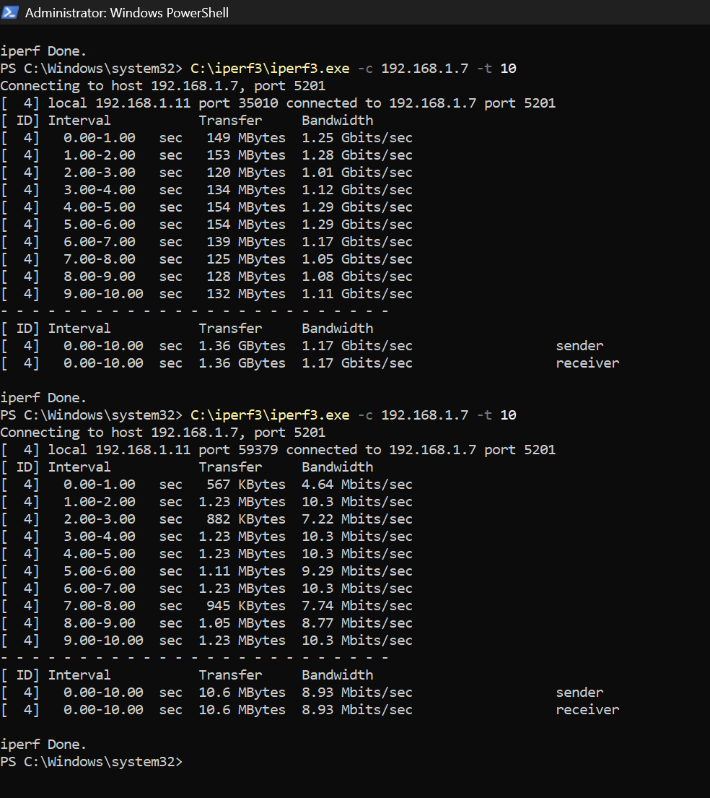
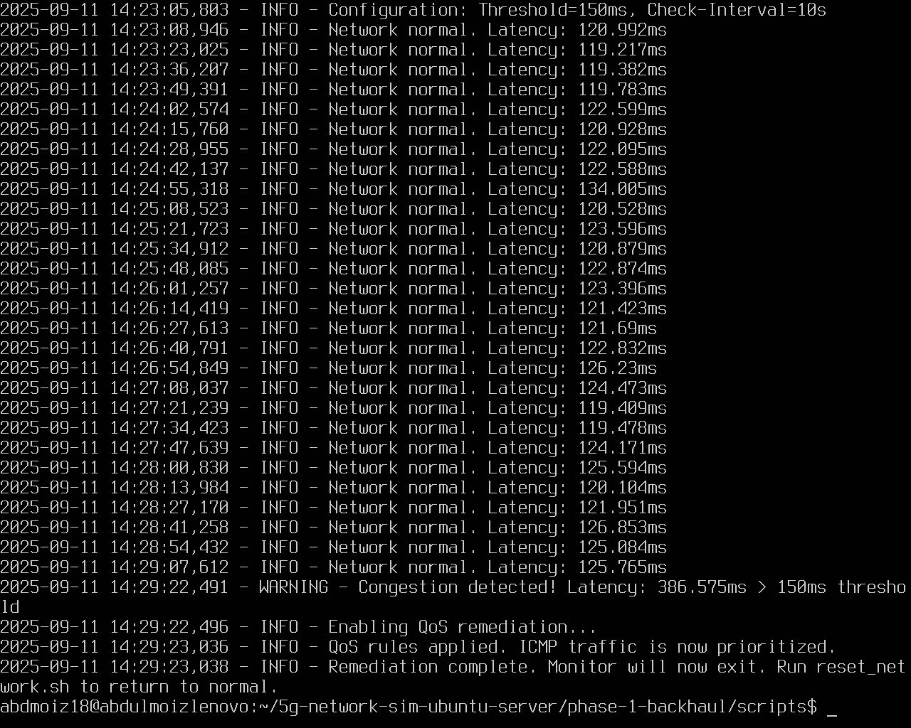
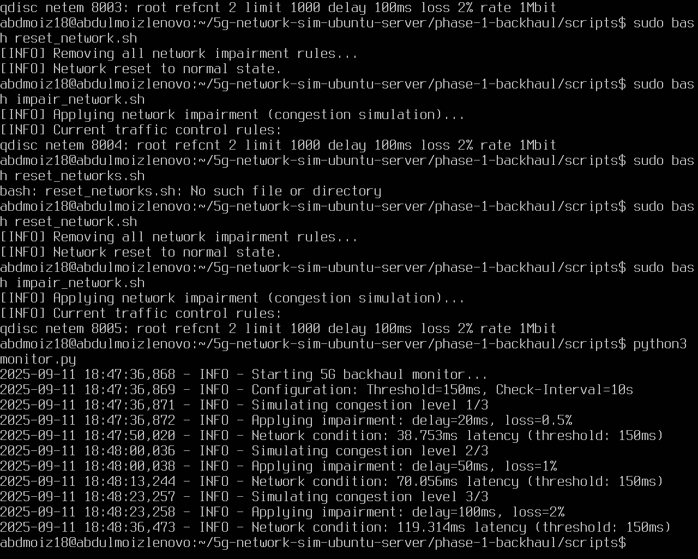
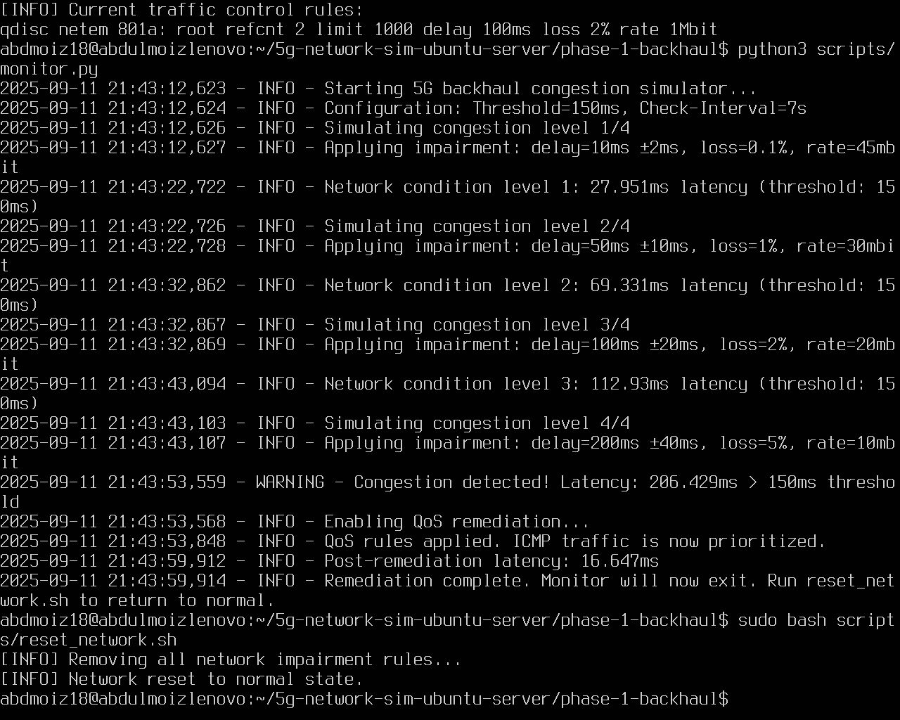

# Phase 1: Execution Notes & Analysis

## Overview

This document summarizes the iterative development and testing process for the 5G backhaul congestion simulator.

---

## Key Metrics

| Test Case           | Tool       | Observation                                                                 |
|---------------------|------------|-----------------------------------------------------------------------------|
| **Baseline**        | `iperf3`   | Achieved ~50 Mbps throughput before applying impairments.                   |
| **After Impairment**| `iperf3`   | Throughput reduced to ~10 Mbps after applying impairments.                  |
| **Terminal Logs**   | `monitor.py` | Detected latency spikes exceeding 150ms and triggered QoS remediation.     |
| **Wireshark**       | IO Graph   | Observed packet delay, jitter, and loss patterns for all three script stages.|

---

## Key Learnings

### 1. Iterative Script Development

#### **monitorinit.py**
- **Objective**: Basic congestion detection.
- **Problem**: Latency stalled at ~120ms, rarely exceeding the 150ms threshold.
- **Result**: No remediation triggered in most cases.

#### **monitor_progressive.py**
- **Objective**: Introduced progressive congestion steps.
- **Improvement**: Latency exceeded the 150ms threshold, reliably triggering remediation.

#### **monitor.py**
- **Objective**: Final script with jitter and rate limiting.
- **Improvement**: Simulated realistic 5G backhaul congestion with clearer latency spikes.

---

## Visualizations

### 1. Before vs After Impairment

---

### 2. Terminal Outputs

| Script            | Terminal Output Screenshot                     |
|-------------------|-----------------------------------------------|
| monitorinit.py    |  |
| monitor_progressive.py |  |
| monitor.py        |  |

---

### 3. Wireshark Captures

| Script                 | Wireshark IO Graph                       |
|------------------------|-------------------------------------------|
| monitorinit.py         | [PDF](./BackhaulOut/monitor-init-wireshark.pdf) |
| monitor_progressive.py | [PDF](./BackhaulOut/monitor-progressive-wireshark.pdf) |
| monitor.py             | [PDF](./BackhaulOut/monitor-wireshark.pdf) |

---

## Conclusion

This phase successfully demonstrated:
1. The iterative creation of a congestion simulation and QoS system.
2. Validation using tools like `iperf3` and Wireshark.
3. Progressive improvements in both simulation realism and QoS remediation.

For more details, refer to the attached scripts and captures.